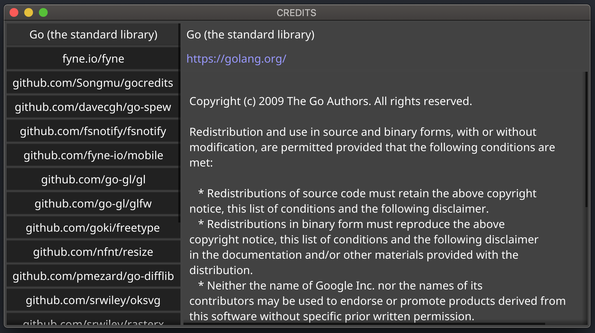

fyne-credits-generator
====

Automatically generate credits window for the [Fyne](https://fyne.io/) application.

## Installation

```
$ go install github.com/lusingander/fyne-credits-generator/cmd/fyne-credits-generator@latest
```

## Usage

First, execute `fyne-credits-generator` command in the directory where go.mod is located.

```
$ cd <fyne project directory>
$ fyne-credits-generator > credits.go
```

Then, all you have to do is call `CreditsWindow` function in your Fyne application, like this:

```go
button := widget.NewButton("Show credits", func() {
    CreditsWindow(fyne.CurrentApp(), fyne.NewSize(800, 400)).Show()
})
```
And you can show a window like this:


See the [sample application](./cmd/sample) for an example.

More info:
```
$ fyne-credits-generator -help
```

### old style

This generate code for Fyne v2.0 or later.
If you want to generate code for Fyne v1.4 or earlier, you can specify the `target`.

The components used by 1.4 and later are different from those used by 1.3 and earlier. So if you want to use Fyne v1.3.x or earlier, specify `target=1.3`.

```
$ fyne-credits-generator -target=1.3 > credits.go
$ fyne-credits-generator -target=1.4 > credits.go
```



## Requirements

Application must use go modules for dependency management.

## Note

This application uses [gocredits](https://github.com/Songmu/gocredits) to collect LICENSE files.
